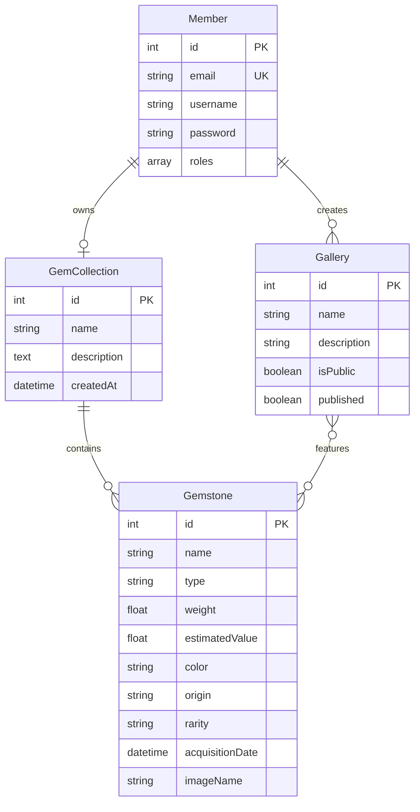

# Gem Vault


Full-stack gemstone collection management platform with REST API, role-based access control, and image upload support.

---

## Features

- **Gemstone CRUD with image uploads** — full lifecycle management powered by VichUploaderBundle
- **Search & filter** — query by type, color, rarity, and origin
- **Collections** — organize gemstones into named collections
- **Public/private galleries** — curate and publish galleries with fine-grained visibility control
- **User registration & authentication** — form-based login with Symfony Security
- **Role-based access control** — Admin and Collector roles with scoped permissions
- **REST API** — paginated JSON endpoints with query filters
- **Responsive UI** — Bootstrap 5 templates rendered server-side with Twig
- **Docker Compose** — one-command development environment
- **Data fixtures** — pre-loaded demo data for instant exploration

## Tech Stack

| Layer | Technology |
|---|---|
| Backend | PHP 8.2, Symfony 6.4 |
| Database | PostgreSQL 16, Doctrine ORM 3.x |
| Frontend | Twig, Bootstrap 5 |
| Authentication | Symfony Security, Form Login |
| File Upload | VichUploaderBundle |
| Testing | PHPUnit 9.5 |
| CI/CD | GitHub Actions |
| Infrastructure | Docker Compose |

## Architecture



## Quick Start

```bash
# Clone
git clone https://github.com/salim-lakhal/gem-vault-php.git
cd gem-vault-php

# Start services
docker compose up -d

# Install dependencies
composer install

# Setup database
cp .env.example .env.local
# Edit .env.local with your database credentials

php bin/console doctrine:database:create
php bin/console doctrine:schema:create
php bin/console doctrine:fixtures:load --no-interaction

# Run the server
symfony serve
# or
php -S localhost:8000 -t public/
```

## API Documentation

### Endpoints

| Method | Endpoint | Description |
|---|---|---|
| `GET` | `/api/gemstones` | List gemstones (paginated, filterable) |
| `GET` | `/api/gemstones/{id}` | Get gemstone details |
| `GET` | `/api/galleries` | List published galleries |
| `GET` | `/api/galleries/{id}` | Get gallery with gemstones |

### Query Parameters for `/api/gemstones`

| Parameter | Description |
|---|---|
| `type` | Filter by gemstone type |
| `color` | Filter by color |
| `rarity` | Filter by rarity |
| `page` | Page number (default: 1) |
| `limit` | Items per page (default: 20) |

### Example Response

```json
{
  "data": [
    {
      "id": 1,
      "name": "Diamond",
      "type": "Precious",
      "weight": 1.5,
      "estimatedValue": 15000,
      "color": "White",
      "origin": "South Africa",
      "rarity": "Rare"
    }
  ],
  "page": 1,
  "totalPages": 1,
  "total": 9
}
```

## Demo Credentials

| Role | Email | Password |
|---|---|---|
| Admin | `admin@gemvault.dev` | `admin123` |
| Collector | `collector@gemvault.dev` | `collector123` |
| Gemologist | `gemologist@gemvault.dev` | `gemologist123` |

## Project Structure

```
gem-vault-php/
├── config/             # Symfony configuration (routes, services, packages)
├── public/             # Web root (index.php, uploaded assets)
├── src/
│   ├── Controller/     # HTTP controllers and API endpoints
│   ├── Entity/         # Doctrine ORM entities
│   ├── Form/           # Symfony form types
│   ├── Repository/     # Doctrine repositories with custom queries
│   └── DataFixtures/   # Demo data fixtures
├── templates/          # Twig templates
├── tests/              # PHPUnit test suites
├── compose.yaml
├── Dockerfile
└── composer.json
```

## Testing

```bash
php bin/phpunit
```

## License

MIT
